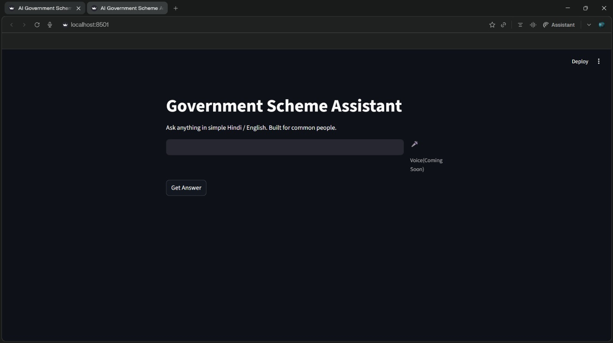
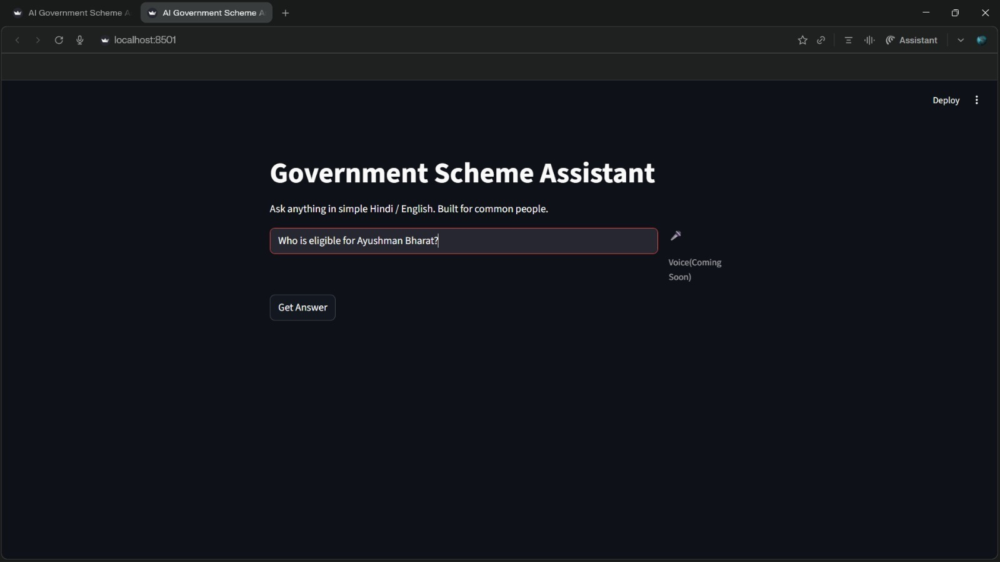
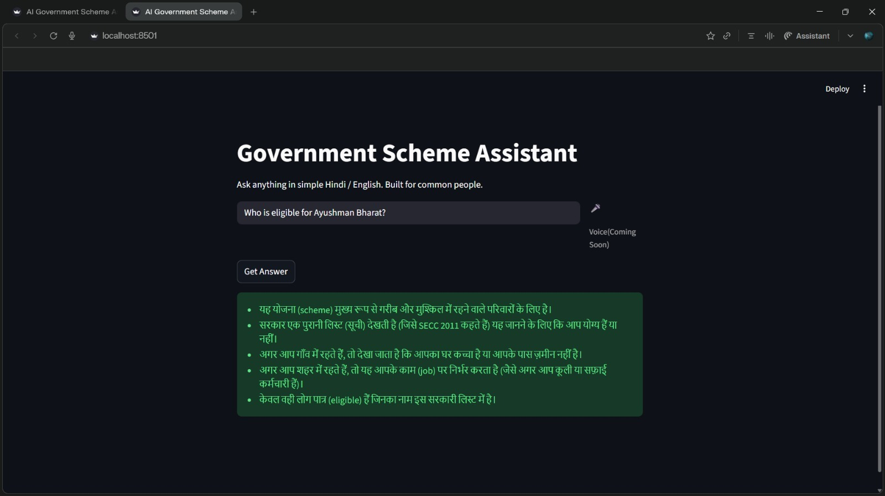
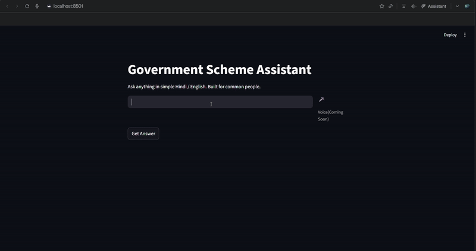

# INFORMA – Government Scheme Assistant 🌐🤖

## 📌 Project Overview
INFORMA is a smart web-based AI assistant designed to simplify complex information and make it easily accessible for users. The platform uses advanced APIs to understand user queries and provide clear, simplified, and meaningful responses in real time.

It also supports voice-based interaction, enabling users to communicate using voice and receive responses in text or audio format, making information access faster, easier, and more inclusive.

---

## 🚀 Key Features
- 🔍 Smart query understanding using AI-powered APIs
- 🧠 Simplification of complex information into easy language
- 🎙️ Voice-to-Text functionality
- 🔊 Text-to-Voice response generation
- 💬 Voice-to-Voice interaction
- 🌐 Web-based interactive interface
- ⚡ Real-time response system

---

## 🛠️ Technologies Used
- Frontend: HTML, CSS, JavaScript
- AI API: External AI API integration
- Speech APIs: Web Speech API / Voice APIs
- Hosting: (Optional – if you deployed it)

---

## 🎯 Problem Statement
Many users struggle to understand complex information due to technical language, accessibility barriers, and lack of interactive tools. Existing platforms often provide information but fail to make it simple, interactive, and user-friendly.

---

## 💡 Our Solution
INFORMA provides a new approach to information access by combining AI-powered APIs with voice-based interaction and a user-friendly interface. It transforms complex content into simple language and allows users to interact using voice or text, making knowledge more accessible for everyone.

---

## 🖥️ Demo Preview

### Website Interface

### AI Interaction Demo

---

## 📂 Project Structure
/INFORMA
│── README.md
│── design.md
│── requirements.md
│── input.jpeg
│── image.jpeg
│── output.jpeg
│── demo.gif

---

## 🔮 Future Scope
- Integration of Machine Learning models for better personalization
- Multi-language support
- Advanced intent detection and analytics
- Mobile application version
- User profiles and history tracking

---

## 👥 Team
Team Name: AI Buddy

Members:
- Your Name – Nikita Kumari
              Suraj Bhan
  
---

## 🏁 Conclusion
INFORMA demonstrates how AI-powered APIs and voice-based technologies can transform the way users access and understand information. The project has strong potential to evolve into a powerful intelligent information platform in the future.

